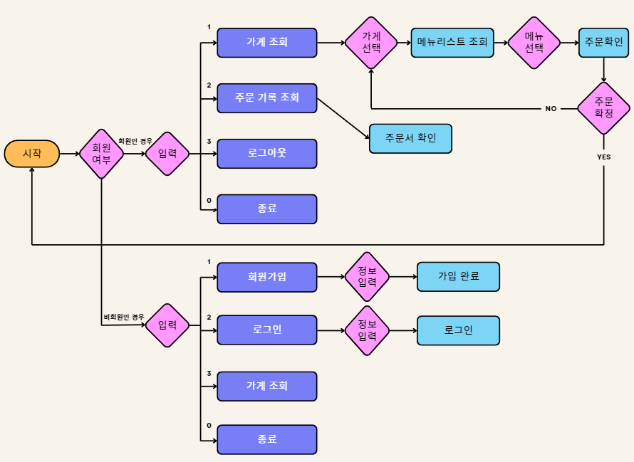
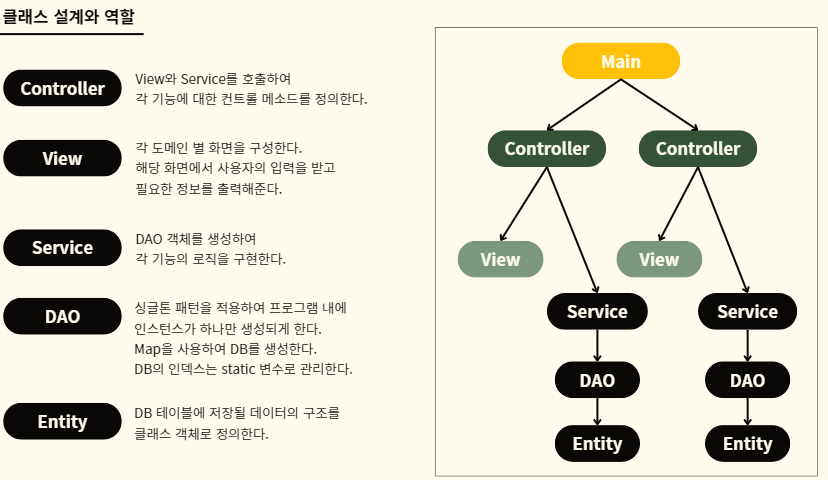

# 배달의 만족 : Java 프로젝트

> 배달의 민족을 레퍼런스한 배달음식 주문 서비스

## 팀원 및 역할

|    | 김민중  | 박소연   | 박진아  | 이원규   | 이현주  | 최경서  |
|----|------|-------|------|-------|------|------|
| 직위 | QA   | DBA   | PM   | CTO   | 기획   | PL   |
| 구현 | user | store | user | order | Main | menu |


## 패키지 구조

패키지 구조는 도메인 별로 나눴습니다.
 
패키지 내부에는 도메인과 관련된 클래스 및 Enum을 배치하였습니다. 

크게 menu, order, store, user로 구분됩니다.

```
|- Main
|- menu   
|   |- Menu    
|   |- MenuController   
|   |- MenuDAO    
|   |- MenuInit    
|   |- MenuService   
|   |- MenuStatus   
|   ㄴ MenuView   
|- order   
|   |- Order    
|   |- OrderController   
|   |- OrderDAO    
|   |- OrderService   
|   |- OrderStatus   
|   ㄴ OrderView   
|- store   
|   |- Category   
|   |- Store   
|   |- StoreController   
|   |- StoreDAO   
|   |- StoreInit   
|   |- StoreService   
|   ㄴ StoreView   
ㄴ user   
    |- User   
    |- UserController   
    |- UserDAO   
    |- UserInfoTitle   
    |- UserService   
    ㄴ UserView   
```


## 개발 환경

- JDK 17
- IDE: IntelliJ
- OS: MacOS / Window

## 사용자 프로세스



1. 프로그램을 시작합니다.
   1. 회원 로그인 여부를 확인합니다.
      1. 비회원인 경우 아래 화면이 나옵니다.
          ```
         ===============배달의만족===============
          환영합니다. 배달의만족입니다. 동작을 선택해주세요.
          주문은 회원만 가능합니다 :)
         1. 회원가입
         2. 로그인
         3. 가게 조회하기
         0. 종료
          =======================================
          입력:
            ```
          a-1. 회원가입
            ``` 
         =================회원가입=================
            회원가입을 진행합니다.
            아이디, 비밀번호, 닉네임, 주소, 전화번호가 필요해요.
            정보를 입력해주세요!
            ========================================
            아이디:
            비밀번호:
            닉네임:
            주소:
            전화번호:
         ```
          a-2. 로그인
            ```
         =============로그인=============
            로그인을 진행합니다. 정보를 입력해주세요.
            ==============================
            아이디:
            비밀번호:
         ```
      b. 회원인 경우   
        
        ```
         ===============배달의만족===============
          환영합니다. 배달의만족입니다. 동작을 선택해주세요.
          주문은 회원만 가능합니다 :)
          1. 가게 조회하기
          2. 주문 기록 조회
          3. 로그아웃
          0. 종료
          =====================================
          입력:
        ```
      
        b-1. 가게 조회   

            ```
            ======카테고리======
            1. 일식
            2. 중식
            3. 한식
            4. 양식
            5. 디저트
               ...
            0. 뒤로
            ==================
            입력:
            ```
        
        b-1-1. 가게 메뉴 조회
         ```
         ======샤오차이나======
      1. 짜장면
      2. 짬뽕
      3. 짬짜면
      4. 탕수육
         ...
      0. 뒤로가기
         ===================
         입력:
         ```

        b-1-1-1. 주문
         ```
         ==========주문==========
      '탕수육' 주문하시겠습니까?
         1. 네
         2. 아니요
         =======================
         입력:
      ```
        b-2. 주문 기록 조회
      ```
      ==================주문 내역=================
      1. 가게명: 홍콩반점 / 메뉴: 짜장면 / 주소: 내 집주소
      ....
      ==========================================
      ```

## 기능

### 주 구현 기능
1. 회원 가입 기능
2. 로그인 기능
3. 로그아웃 기능
3. 가게 카테고리별 조회 기능
4. 가게별 메뉴 조회 기능
5. 메뉴 주문 기능
6. 주문 기록 조회 기능

### 부 구현 기능
1. 회원가입 정보 유효성 검사
2. 사용자 입력 유효성 검사


## 프로젝트 아키텍처

- MVC 패턴 사용

